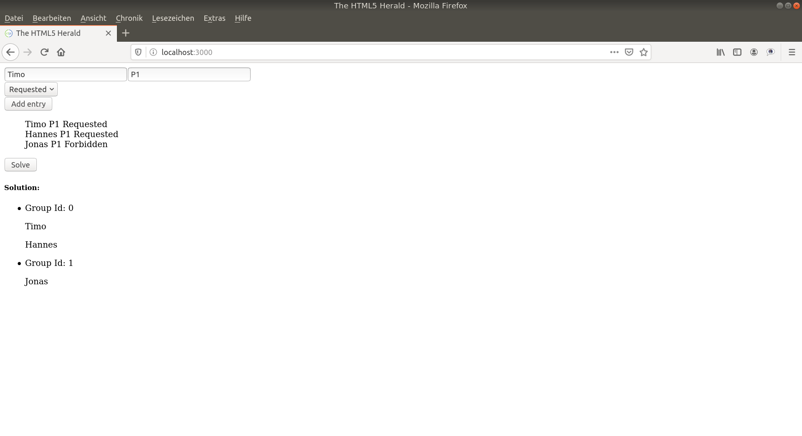

# ups-cljs-ui
Simple client without styling written in ClojureScript + Reagent + Reframe

# Description

The following project presents an example of how a client for one of the previous projects:
https://github.com/DucTuLeAnh/user-privilege-scheduler
can be created using ClojureScript + Reagent + Reframe. 

